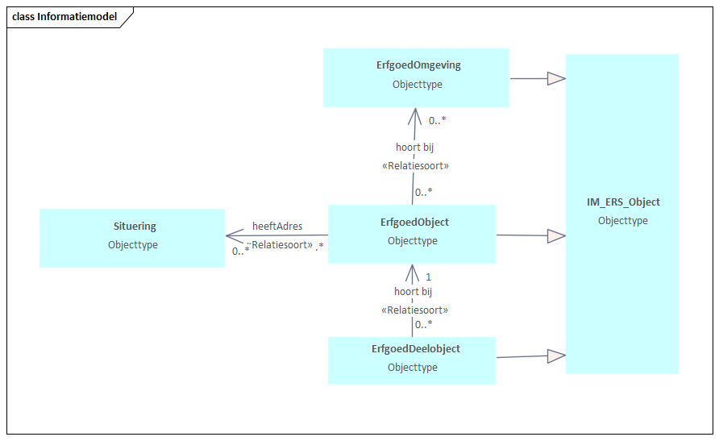

# Informatiemodel

Het informatiemodel beschrijft de logische relaties tussen de belangrijkste entiteiten van de registratie. 
In dit schema is te zien dat het model bestaat uit drie lagen.

## ErfgoedObject

Gebouwen, andere bouwwerken zoals bruggen of sculpturen, alsook parken en andere
bovengrondse structuren kunnen zijn geregistreerd als ErfgoedObject. Dit vanwege hun
waarde bijvoorbeeld op grond van hun schoonheid of door het belang dat aan hun
geschiedenis wordt gehecht. Registratie betekent dat aan het object regels kunnen zijn
verbonden waar een beschermende werking van uitgaat. Registratie kan ook betekenen dat
de objectinformatie context geeft voor het toepassen van deze regelgeving.

Zie [[[#objecttype-erfgoedobject]]] voor detailinformatie.

## ErfgoedOmgeving

ErfgoedObjecten kunnen deel uitmaken van een omgeving, waaraan zij ook een bepaalde
waarde ontlenen. De bescherming van het ErfgoedObject heeft omgekeerd ook betekenis
voor de bescherming van de omgeving. Dit kan nader zijn uitgewerkt in de regels. Voor één
ErfgoedObject geldt dat er meerdere ErfgoedOmgevingen relevant kunnen zijn.

Zie [[[#objecttype-erfgoedomgeving]]] voor detailinformatie.

## ErfgoedDeelobject

ErfgoedObjecten kunnen één of meerdere ErfgoedDeelobjecten hebben. Deze deelobjecten
beschrijven bijvoorbeeld een bepaald onderdeel in detail. ErfgoedDeelobjecten ontlenen hun
bescherming aan de bescherming van het ErfgoedObject als geheel.

Zie [[[#objecttype-erfgoeddeelobject]]] voor detailinformatie.

## Situering
Op het niveau van het ErfgoedObject ligt tevens een relatie met de Basisregistratie Gebouwen (BAG), via adresID en een eventueel een aanduiding van de relatie (situering) van dit adres ten opzichte van het object.</mark>

Zie [[[#objecttype-situering]]] voor detailinformatie.

## MIM-model
Een aantal begrippen uit MIM-standaard lichten wij hieronder toe. 

**authentiek gegeven**: Een kenmerk is authentiek indien de juistheid (hoogwaardige kwaliteit) van het gegeven gewaarborgd wordt via formele inwinningsprocessen en wettelijk regelingen. De waarde refereert aan het inwinningsproces of de regeling in questie, bijvoorbeeld de basisregistratie. Een authentiek gegeven in de Erfgoed Registratie standaard heeft waarde 'Overig'. Dat betekent dat het gegeven hoogwaardige kwaliteit heeft op basis van de eigen (domeinspecifieke) inwinningsprocessen van de erfgoedstandaard.

**classificerend**: Een kenmerk is classificerend wanneer het een objecttype indeelt in subtypen. In de erfgoedstandaard geldt dit voor attribuutsoort 'type'. Dit komt voor bij zowel objecten als deelobjecten en omgevingen. De waardelijsten (ennumeraties) van de drie niveaus verschillen enigszins; een efgoeddeelobject kent een iets andere indeling naar types dan het erfgoedobject. En een omgeving kent heel eigen subtypen.

**mogelijk geen waarde**: Een kenmerk heeft 'mogelijk geen waarde' wanneer niet op voorhand zeker is dat de waarde bekend is en ook of er wel een waarde is. Dit behoeft enige toelichting in combinatie met het de vraag of het gaat om een verplicht gegeven of een optioneel gegeven...
