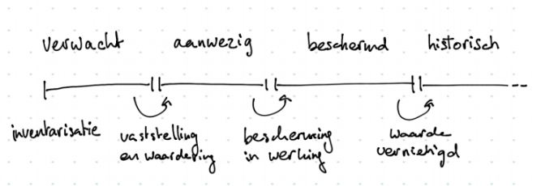
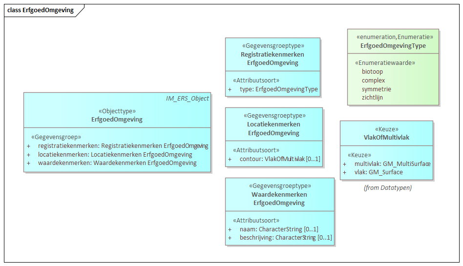
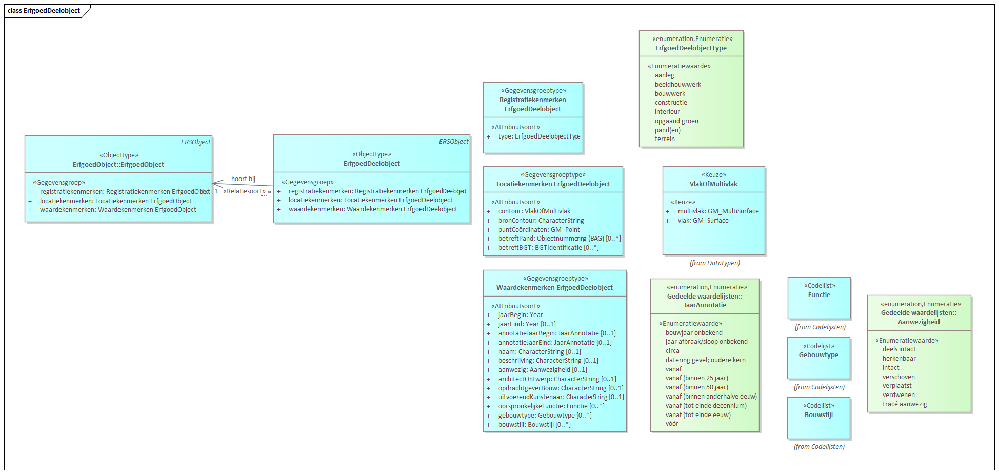

# Objecttypen

## Objecttype ErfgoedObject

| **Objecttype-eigenschap** | **Waarde** |
| ---- | ---- |
| **Naam** | ErfgoedObject |
| **Herkomst** | ERS|
| **Definitie** | Een ErfgoedObject is een fysiek object (bouwwerk, historische aanleg of structuur) met een zekere cultuurhistorische waarde. In het algemeen is sprake van een onroerend of niet-verplaatsbaar karakter.|
| **Herkomst definitie** | ERS|
| **Toelichting** | De registratie van een ErfgoedObject vindt plaats omwille van de kenbaarheid van cultuurhistorische waarden op een fysieke locatie. De levenscyclus van het object hangt samen met deze waarde. Het object ontstaat met de feitelijk realisatie van de cultuurhistorische waarde en het object houdt op te bestaan wanneer deze waarde is vernietigd. Dit voltrekt zich onafhankelijk van de levenscyclus van het pand of het terrein zelf. Het is ook niet afhankelijk van het tijdstip waarop de waarde wordt onderkend of toegeschreven.|
| **Datum opname**| 20191001 | 

Een ErfgoedObject kan een beschermde status hebben. De kenmerken van het
ErfgoedObject bieden aanknopingspunten om de tijdstippen die in deze procedure van
belang zijn, vast te leggen. De beschermde status zal een betekenis moeten hebben in
relatie tot regelgeving en beleid. Indien van toepassing is een verwijzing vereist naar de
bestuurlijke grondslag (het besluit) van de beschermde status.

De locatie van het ErfgoedObject wordt op verschillende manieren geduid. Met geometrie
wordt de locatie op de kaart vastgelegd. Met behulp van adressering kan de locatie ook in
administratieve zin worden bepaald. Om de aard van het ErfgoedObject te kennen is een
typologie gedefinieerd. Deze bepaalt bijvoorbeeld of sprake is van een adresseerbaar
object.

Het ErfgoedObject bestaat vanwege de cultuurhistorische waarde. Enkele kenmerken van
het object kunnen worden gebruikt om deze waarde nader te beschrijven.

### Kenmerken

#### Registratiekenmerken

Deze leggen vast vanaf wanneer een object is geregistreerd, wanneer de registratie is
gewijzigd (versies van registraties) en welke aard de registratie heeft.

De aard van een registratie vertelt iets over de beleidsmatige betekenis van het object: gaat
het om een verwachte cultuurhistorische waarde, een aanwezige, een beschermde of een
historische waarde. Dit betekent dat er ook registraties kunnen zijn van cultuurhistorische
waarden die worden vermoed, maar niet zeker zijn. En van waarden die er ooit waren, maar
inmiddels niet meer bestaan. De aard van een registratie kan in de loop van de tijd wijzigen.
Onderstaand schema toont de mogelijke overgangen:

De overgangen hoeven niet stuk voor stuk doorlopen te worden; er kunnen ook stappen
worden overgeslagen.
Is de aard van de registratie een beschermde waarde, dan is een reeks attributen verplicht.
Deze attributen gaan bijvoorbeeld over de datum waarop de bescherming in werking trad en
welk bevoegd gezag daartoe besloot.

De overgang naar historisch is interessant. Dit betekent dat de cultuurhistorische waarde
zoals door het record is beschreven er niet meer is. Er is een belangrijke relatie met het veld
jaarEind, dat het einde van de materiële levensduur van het object markeert. Dit veld hoort
gevuld te zijn in combinatie met aardRegistratie historisch.

Dat de cultuurhistorische waarde is vernietigd kan betekenen dat het object er niet meer is,
maar dat hoeft niet. Er kan dus nog een actuele koppeling met een bestaand pand en een
bestaand adres zijn. Is het fysieke object er helemaal niet meer, dan dienen deze
koppelingen te worden verwijderd.

Als een object beschermd is en de waarde wordt (of blijkt) vernietigd, dan wordt de
bescherming doorgaans opgeheven. Ook kan het zijn dat een procedure is gestart, maar
eindigt in het besluit niet aan te wijzen. De velden die de bescherming vastleggen worden op
dat moment geschoond. Aan de datumvelden is te zien dat het object eerder wel
bescherming genoot; een toelichting hierop (zoals welke bescherming dit betrof) is verplicht.

Een apart geval betreft waarden die verwacht worden en na inventarisatie niet aanwezig
blijken. Ook dan zal de ooit ‘verwachte’ waarde niet blijken uit de actuele registratie: de
registratie van het betreffende object wordt beëindigd met een datumEindeRegistratieID.

#### Locatiekenmerken

Om de locatie van een object te kennen zijn zowel geometrie als adresgegevens van
belang. De geometrie en de adressen hebben een vergelijkbare functie: ze dienen de
kenbaarheid van het object.

De registratie gaat ervan uit dat een bescherming rust op een object. Dit object kan in de
loop van de tijd wijzigen; de bescherming blijft rusten op het object als geheel. Dat betekent
dat de contour in de loop van de tijd kan wijzigen. De contour is dus niet bedoeld om precies
te begrenzen wat er wel of niet beschermd is.

Met behulp van landelijke basisregistraties kunnen de locatiegegevens (contour en adres)
actueel blijven. Een wijziging in de basisregistratie zal niet altijd geautomatiseerd kunnen
worden verwerkt; dat hangt af van de aard van de wijziging.

#### Waardekenmerken
Deze kenmerken beschrijven inhoudelijk de cultuurhistorische waarde van het object. De
standaard maakt daarbij gebruik van tekst velden en van lijsten. De lijsten zijn bij voorkeur
afgeleid van nationale termenlijsten. Het beheer op deze lijsten zal in de toekomst verder
vorm moeten krijgen.

#### tbd

## Objecttype ErfgoedOmgeving

| **Objecttype-eigenschap** | **Waarde** |
| ------------- | ------------- |
| **Naam** | ErfgoedOmgeving |
| **Herkomst** | ERS|
| **Definitie** | Een ErfgoedOmgeving beschrijft de context (één of meerdere) die voor de cultuurhistorische waarde van het ErfgoedObject van belang is.|
| **Herkomst definitie** | ERS|
| **Toelichting** | Een ErfgoedOmgeving kan alleen bestaan in combinatie met het (de) bijbehorende ErfgoedObject(en). Er worden verschillende typen omgeving onderscheiden, waarvoor verschillende regelgeving van toepassing kan zijn. Een groep ErfgoedObjecten kan bijvoorbeeld deel uitmaken van een complex . Of één of meer ErfgoedObjecten kunnen op een terrein of binnen een bepaald gebied liggen dat van belang is voor het ErfgoedObject en dat wordt aangeduid als ‘biotoop’.|
| **Datum opname**| 20191001 | 

### Kenmerken

De **registratiekenmerken** van een ErfgoedOmgeving zijn vergelijkbaar met die van een
ErfgoedObject.

| **attribuut** | **definitie** |
| ------------- | ------------- |
|identificatie  | Identificerende sleutel |
| datumBeginRegistratieID | Formele levensduur van het omgevingselement |
| datumEindeRegistratieID | Formele levensduur van het omgevingselement |
| tijdstipBeginVersienr|Formele historie van het omgevingselement |
| tijdstipEindeVersienr| Formele historie van het omgevingselement |
| type| Aard van het omgevingselement |

Voor de ErfgoedOmgeving is alleen een contour gedefinieerd als **locatiekenmerk**. Deze is
verplicht voor bepaalde typen ErfgoedOmgeving, zoals de biotoop en de zichtlijn.

| **attribuut** | **definitie** |
| ------------- | ------------- |
|contour  | Ruimtelijke contour van het omgevingselement. Verplicht afhankelijk van het type: een biotoop en zichtlijn kennen een verplichte contour. |

De **waardekenmerken** voor de ErfgoedOmgeving zijn beperkt tot een naam en
omschrijving. De ErfgoedOmgeving is te beschouwen als een eigenschap van het
ErfgoedObject; niet als een ErfgoedObject op zichzelf.

| **attribuut** | **definitie** |
| ------------- | ------------- |
|naam  | Naam waaronder het omgevingselement bekend staat |
|beschrijving  | Beschrijving van het omgevingselement |

#### identificatie
| **Attribuutsoort-eigenschap** | **Waarde** |
| ---- | ---- |
| **Naam** | identificatie |
| **Herkomst** | **NEN3610??** *(verplicht):  De registratie of het informatiemodel waaraan het modelelement ontleend is dan wel de eigen organisatie indien het door de eigen organisatie toegevoegd is.* |
| **Definitie** | Identificerende sleutel |
| **Herkomst definitie** | **NEN3610??** *(verplicht): De registratie of het informatiemodel waaruit de definitie is overgenomen dan wel een aanduiding die aangeeft uit welke bronnen de definitie is samengesteld.* |
| **Toelichting** | Door het systeem wordt aan de identificatie een Namespace toegevoegd. Namespace: een unieke verwijzing naar de registratie die de identificatie uitdeelt (de bronhouder). Deze lijst van registraties wordt beheerd binnen de context van NEN 3610. Binnen Nederland zal deze namespace vrijwel altijd met ‘NL’ beginnen. Lokaal id: unieke identificatiecode binnen de registratie van de bronhouder. Deze is verplicht omdat een nieuwe aanlevering (update) altijd per object herleidbaar moet zijn naar de eerdere aanlevering. Ook records die gegevens over Rijksmonumenten bevatten krijgen de Namespace van de aanleverende partij (betreffende gemeente).|
| **Datum opname**| 20191001 | 
| **Indicatie materiële historie** | *Nee* |
| **Indicatie formele historie** | *Nee* |
| **Kardinaliteit** | *1* |
| **Authentiek** | Overig |
| **Indicatie afleidbaar** | *Nee*|
| **Indicatie classificerend** | *Nee*|
| **Mogelijk geen waarde** | *Nee*| 
| **Identificerend** | Ja|

#### versie
| **Attribuutsoort-eigenschap** | **Waarde** |
| ---- | ---- |
| **Naam** | versie |
| **Herkomst** | **??** *(verplicht):  De registratie of het informatiemodel waaraan het modelelement ontleend is dan wel de eigen organisatie indien het door de eigen organisatie toegevoegd is.* |
| **Definitie** | Wordt door het systeem gegenereerd **Wat is 'het systeem'? - Zou de definitie niet iets moeten zijn als 'Een versienummer, bij voorkeur automatisch gegenereerd, dat in combinatie met het veld 'identificatie' het record uniek maakt** |
| **Herkomst definitie** | **??** *(verplicht): De registratie of het informatiemodel waaruit de definitie is overgenomen dan wel een aanduiding die aangeeft uit welke bronnen de definitie is samengesteld.* |
| **Toelichting** | Een versienummer, gekoppeld aan de identificerende sleutel maakt het record uniek. |
| **Datum opname**| 20191001  | 
| **Authentiek** | Overig |
| **Identificerend** | **Ja??**|

#### datumBeginRegistratieID
| **Attribuutsoort-eigenschap** | **Waarde** |
| ---- | ---- |
| **Naam** | datumBeginRegistratieID |
| **Herkomst** | ERS|
| **Definitie** | Formele levensduur van het omgevingselement |
| **Herkomst definitie** | ERS|
| **Toelichting** | begindatum en -tijd van de registratie van de ErfgoedOmgeving. De begintijd is het
moment dat de registratie voor het eerst is aangemaakt.|
| **Datum opname**| 20191001 | 
| **Authentiek** | Overig |

#### datumEindeRegistratieID
| **Attribuutsoort-eigenschap** | **Waarde** |
| ---- | ---- |
| **Naam** | datumEindeRegistratieID |
| **Herkomst** | ERS|
| **Definitie** | Formele levensduur van het omgevingselement |
| **Herkomst definitie** | ERS|
| **Toelichting** | einddatum en -tijd van de registratie van de ErfgoedOmgeving. Zolang de eindtijd
niet is ingevuld is de registratie aanwezig en voor gebruik raadpleegbaar.|
| **Datum opname**| 20191001 | 
| **Authentiek** | Overig |

#### tijdstipBeginVersienr
| **Attribuutsoort-eigenschap** | **Waarde** |
| ---- | ---- |
| **Naam** |  tijdstipBeginVersienr|
| **Herkomst** | ERS|
| **Definitie** | Formele historie van het omgevingselement |
| **Herkomst definitie** | ERS|
| **Toelichting** | attribuut voor historie van veranderingen van eigenschappen van een object in de
registratie. Bij een wijziging in de administratie wordt de einddatum geregistreerd, alvorens de wijzigingen worden vastgelegd in een volgend record met een nieuw versienummer en hetzelfde ID.|
| **Datum opname**| 20191001 | 
| **Authentiek** | Overig |

#### tijdstipEindeVersienr
| **Attribuutsoort-eigenschap** | **Waarde** |
| ---- | ---- |
| **Naam** |  tijdstipEindeVersienr|
| **Herkomst** | ERS|
| **Definitie** | Formele historie van het omgevingselement |
| **Herkomst definitie** | ERS|
| **Toelichting** | attribuut voor historie van veranderingen van eigenschappen van een object in de
registratie. Bij een wijziging in de administratie wordt de einddatum geregistreerd, alvorens de wijzigingen worden vastgelegd in een volgend record met een nieuw versienummer en hetzelfde ID.|
| **Datum opname**| 20191001 | 
| **Authentiek** | Overig |

#### type
| **Attribuutsoort-eigenschap** | **Waarde** |
| ---- | ---- |
| **Naam** |  type|
| **Herkomst** | ERS|
| **Definitie** | Aard van het omgevingselement |
| **Herkomst definitie** | ERS|
| **Toelichting** | |
| **Datum opname**| 20191001 | 
| **Indicatie formele historie** | Ja |
| **Authentiek** | Overig |
| **Indicatie classificerend** | Ja|

#### contour

| **Attribuutsoort-eigenschap** | **Waarde** |
| ---- | ---- |
| **Naam** | contour |
| **Herkomst** | ERS|
| **Definitie** | Ruimtelijke contour van het omgevingselement. Verplicht afhankelijk van het type: een biotoop en zichtlijn kennen een verplichte contour. |
| **Herkomst definitie** | ERS|
| **Toelichting** | mogelijk formaat: wkt bij aanlevering als xml of xls bij aanlevering als gisbestand is de geometrie formaatspecifiek (nog te bepalen welke formaten worden geaccepteerd) of GML|
| **Datum opname**| 20191001 | 
| **Indicatie formele historie** | Ja |
| **Authentiek** | Overig |
| **Mogelijk geen waarde** | Ja| 

#### naam
| **Attribuutsoort-eigenschap** | **Waarde** |
| ---- | ---- |
| **Naam** | naam |
| **Herkomst** | ERS|
| **Definitie** | Naam waaronder het omgevingselement bekend staat |
| **Herkomst definitie** | ERS|
| **Toelichting** | |
| **Datum opname**| 20191001 | 
| **Indicatie formele historie** | Ja |
| **Authentiek** | Overig |

#### beschrijving

| **Attribuutsoort-eigenschap** | **Waarde** |
| ---- | ---- |
| **Naam** |  beschrijving|
| **Herkomst** | ERS|
| **Definitie** | Beschrijving van het omgevingselement |
| **Herkomst definitie** | ERS|
| **Toelichting** | |
| **Datum opname**| 20191001 | 
| **Indicatie formele historie** | Ja |
| **Kardinaliteit** | 0..1 |
| **Authentiek** | Overig |
| **Mogelijk geen waarde** | Ja| 

## Objecttype ErfgoedDeelobject

| **Objecttype-eigenschap** | **Waarde** |
| ---- | ---- |
| **Naam** | ErfgoedDeelobject |
| **Herkomst** | ERS|
| **Definitie** | Een ErfgoedDeelobject beschrijft een onderdeel van het ErfgoedObject dat een specifieke
cultuurhistorische waarde heeft.|
| **Herkomst definitie** | ERS|
| **Toelichting** | Een ErfgoedDeelobject kan onderdeel zijn van de fysieke structuur van het ErfgoedObject
zelf. Bijvoorbeeld een winkelpui of een dakconstructie. Of het kan daaraan (al of niet later)
zijn toegevoegd. Bijvoorbeeld een bijzonder interieur of een wandkunstobject.|
| **Datum opname**| 20191001 | 

### Kenmerken

De **registratiekenmerken** van een ErfgoedDeelobject zijn vergelijkbaar met die van een
ErfgoedObject. De typologie van het ErfgoedDeelobject is uitgebreid met drie types die
logischerwijs alleen als onderdeel van een geheel voorkomen: Constructief deel (restant),
Constructief deel (toegevoegd) en Interieur

Het kenmerk “aanwezig” is specifiek voor ErfgoedDeelobjecten. Het is vergelijkbaar met de
aardRegistratie van het ErfgoedObject. Het legt vast hoe groot de kans is dat de beschreven
waarde ook daadwerkelijk aanwezig is. De bescherming wordt niet afzonderlijk geregeld;
deze is altijd een afgeleide van het ErfgoedObject. Hetzelfde geldt voor de aardRegistratie
historisch; deze geldt altijd voor het ErfgoedObject plus bijbehorende ErfgoedDeelobjecten.

Voor het ErfgoedDeelobject zijn de **locatiekenmerken** gelijk aan die van het ErfgoedObject.
Alleen de mogelijkheid voor een aparte adressering geldt hier niet. Er wordt volstaan met de
mogelijkheid om een of meer BAG-panden (of BGT-objecten) te koppelen om een contour te
verwerven.

De **waardekenmerken** voor het ErfgoedDeelobject komen overeen met de de
waardekenmerken voor het ErfgoedObject. Alleen redengevende omschrijving en
CBS-functie zijn niet van toepassing.

#### tbd

## Objecttype Situering

| **Objecttype-eigenschap** | **Waarde** |
| ---- | ---- |
| **Naam** | Situering |
| **Herkomst** | ERS|
| **Definitie** | Een Situering beschrijft de relatie tussen een ErfgoedObject en een bepaald Adres. Het
geeft aan wat het adres zegt over de situering van het ErfgoedObject.|
| **Herkomst definitie** | ERS|
| **Toelichting** | Een ErfgoedObject kan verschillende adressen hebben. Meestal zijn dit de adressen die rechtstreeks toegang geven tot het monument. Soms ligt het adres als gevolg van aanpassingen in het gebouw niet meer in het object zelf, maar in het buurpand. Ook kan een object zelf ‘niet adresseerbaar’ zijn, maar in de buurt van een ander, wel ‘adresseerbaar’ object liggen. In die gevallen is dat in de situering aangegeven.|
| **Datum opname**| 20191001 | 

### Kenmerken

De **registratiekenmerken** voor de records in situering beperken zich tot een ID. Er wordt
geen versiehistorie bijgehouden op de inhoud van de situering.

De **locatiekenmerken** bestaan uit de verwijzing naar het huisnummerrecord in de BAG in
combinatie met een duiding voor de situering, die ook leeg kan zijn.

In de standaard wordt uitgegaan van actuele adressen in de BAG. Tijdens de validatie
worden alle aangeleverde adressen gevalideerd en waar mogelijk geactualiseerd. Vervallen
adressen kunnen alleen in tekst worden weergegeven in toelichtingAdressering van het
ErfgoedObject.

#### tbd

#### <sjabloon>
Sjabloon voor attribuutsoort

| **Attribuutsoort-eigenschap** | **Waarde** |
| ---- | ---- |
| **Naam** |  |
| **Herkomst** | ERS|
| **Definitie** |  |
| **Herkomst definitie** | ERS|
| **Toelichting** | |
| **Datum opname**| 20191001 | 
| **Indicatie materiële historie** | *Nee* |
| **Indicatie formele historie** | *Nee* |
| **Kardinaliteit** | *1* |
| **Authentiek** | Overig |
| **Indicatie afleidbaar** | *Nee*|
| **Indicatie classificerend** | *Nee*|
| **Mogelijk geen waarde** | *Nee*| 
| **Identificerend** | *Nee*|

 
*NB. een aantal (verplichte) metagegevens heeft een defaultwaarde (zie [MIM-specificatie](https://docs.geostandaarden.nl/mim/mim/#defaultwaarden-voor-metagegevens-modelelementen)). Alleen afwijkende waarden hoeven expliciet te worden opgenomen.*
